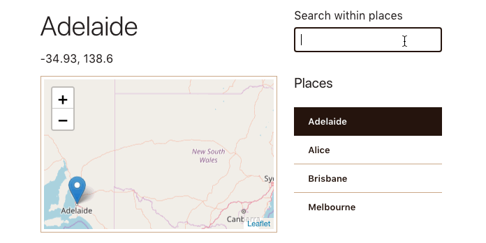

# Vue Map



## Dependencies
- [Vue2Leaflet](https://www.npmjs.com/package/vue2-leaflet)
- [Leaflet](https://www.npmjs.com/package/leaflet)

## Components

### MapMain
This is a parent component for `MapArea` and `MapControls`. A JSON-formatted map dataset is defined here. This component listens to events emitted from `MapControls`, and uses the arguments passed along with events to set the props in `MapArea`.

#### Props
| Prop      | Description                                            | Type  | Required | Default |
| --------- | ------------------------------------------------------ | ----- | -------- | ------- |
| `mapData` | JSON-formatted lat/long data for ten Australian cities | Array | `true`   | none    |

#### Methods
| Method          | Description                                            | Parameters |
| --------------- | ------------------------------------------------------ | ---------- |
| `updateMapArea` | Get index of currently selected city name in `mapData` | `city`     |

### MapArea
A [Leaflet](http://leafletjs.com/) map using [OpenStreetMap](https://www.openstreetmap.org) data is rendered in this component. The [Vue2Leaflet](https://www.npmjs.com/package/vue2-leaflet) package provides `VMap`, `VTileLayer`, and `VMarker` components for creating the necessary map layers.

The map always centers on a place, which is currently selected in `MapControls`.

#### Props
| Prop    | Description                                         | Type   | Required | Default |
| ------- | --------------------------------------------------- | ------ | -------- | ------- |
| `place` | Place object containing city name and lat/long info | Object | `true`   | none    |

### MapControls
This is a custom component, which lists all places in the map dataset in a sidebar. The first item in the list is selected by default on page load. Users can change the selection any time after the initial load.

A search field in this component allows quick filtering of the dataset. Filtering reduces the number of options in the list and just like on page load, selects the first item in the reduced list. Users see an error message when their search term doesn’t match any place in the list.

#### Props
| Prop      | Description                                            | Type  | Required | Default |
| --------- | ------------------------------------------------------ | ----- | -------- | ------- |
| `mapData` | JSON-formatted lat/long data for ten Australian cities | Array | `true`   | none    |

#### Events
|Event name|Description|
|`locationChange`|Triggered when user clicks one of the cities listed in `MapControls` sidebar or when the filtered list is updated and the first item is selected|

#### Methods
| Method        | Description                                                                  | Parameters |
| ------------- | ---------------------------------------------------------------------------- | ---------- |
| `handleClick` | Get city name with event object and trigger a custom, `locationChange` event | `event`    |

#### Computed Properties
| Computed         | Description                                                         | Parameters |
| ---------------- | ------------------------------------------------------------------- | ---------- |
| `filteredCities` | Get list of cities in `mapData` based on user input in search field | none       |

### MapHeader

The header shows the currently-selected city name along with the lat/long values. The header updates either on a search action (keyup) or a select action (click).

#### Props
| Prop    | Description                                         | Type   | Required | Default |
| ------- | --------------------------------------------------- | ------ | -------- | ------- |
| `place` | Place object containing city name and lat/long info | Object | `true`   | none    |

## Build Setup

``` bash
# install dependencies
npm install

# serve with hot reload at localhost:8080
npm run dev

# build for production with minification
npm run build

# build for production and view the bundle analyzer report
npm run build --report
```

For detailed explanation on how things work, checkout the [guide](http://vuejs-templates.github.io/webpack/) and [docs for vue-loader](http://vuejs.github.io/vue-loader).
